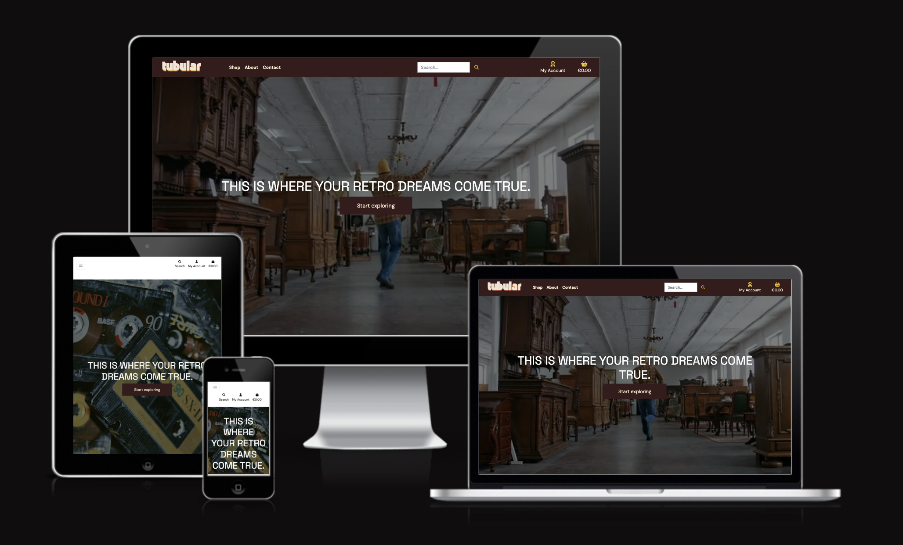
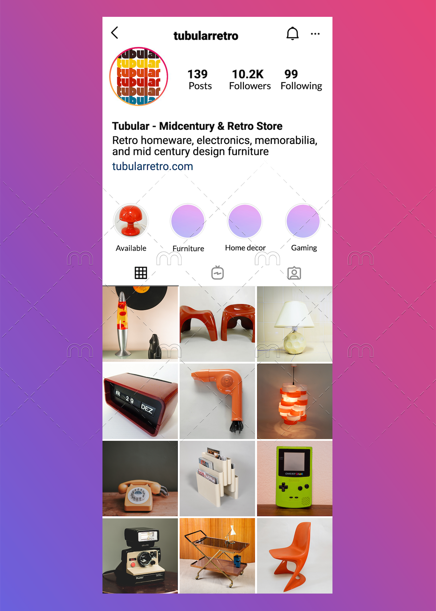

# About this project

Tubular is a fictional online store selling a variety of retro homeware, electronics, and memorabilia, as well as mid-century design furniture. Each item in the store is one of a kind and sold in used/preloved condition. The site also allows users to submit their own items for consignment in the store, and admins can approve or decline the consignment requests. Admins can also add, edit, or delete products on the site without using the Django admin panel.

This project was built to fulfill the requirements of the final project in Code Institute’s Full Stack Development Diploma - eCommerce specialization. The app should be considered a minimum viable product (MVP) of an ecommerce application.
 

**Testing Payment Functionality**: If you wish to test the purchase functionality, please use Stripe’s mock payment details:

- Card no: 4242424242424242
- Expiration: Any future date in the format MM/YY
- CVV: Any 3-digit number
- Postcode: Any 5-digit letter/number combination
  
NOTE: Payments made using an actual payment card will fail and the card will not be charged. No orders made will be fulfilled

**Live Site**: The live site can be found here: [Tubular Retro](https://tubularretro-71f0ca94931e.herokuapp.com/)

# User Stories
You can find all user stories and their associated UAT in [TESTING.md](TESTING.md). You can also review the Github project [here](https://github.com/users/h-bails/projects/3).

# Business Model
This vintage and retro design store caters to individuals who appreciate mid-century design and aesthetics and have a penchant for retro and nostalgic items.

**Primary User Persona**: Our primary user persona would be professionals in their late 20s onwards, who value individuality, are informed about retro and mid-century design, and are interested in home decor.

**Revenue Generation**: Tubular’s overall business generates revenue by curating and selling a diverse range of vintage and retro-inspired products, including home decor, electronics, and miscellany. The online store could be used to supplement a brick and mortar store where customers could view and purchase items in person. Tubular’s online store generates revenue through online sales, using a direct-to-consumer (DTC) approach. Customers browse, select, and purchase products directly from the website via a single payment being taken per order via Stripe.

# Marketing Plan

Margins on second-hand items are generally quite slim, so the marketing focus for Tubular is on foundational platform hygiene, consistency, and cost-effectiveness.

## Marketing Principles

### Foundational Online Presence
- **SEO Optimized Website**: Tubular will maintain an SEO-optimized website, including a robots.txt file and sitemap. Cross-linking with related resources will be utilized whenever possible.
- **Online Marketplaces**: Furniture listings will be cross-posted on popular online marketplaces like Facebook Marketplace and Adverts.ie.
- **Google Maps Optimization**: Tubular's brick-and-mortar store will have its presence optimized in Google Maps.
- **Online Directories**: The store will be listed in relevant online directories.
- **Newsletter Sign-Up**: Customers will have the option to sign up for newsletters through Mailchimp.

### Social Media Advertising
- **Instagram Advertising**: Instagram, a platform popular among vintage enthusiasts, will be used for targeted advertising towards Tubular's user persona(s). See a mockup of the IG account below. 

 

- **Facebook Advertising**: While not the primary platform, a Facebook business account will be created for running ads.
- **Engagement Activities**: Occasional giveaways, competitions, or influencer placements may be considered to organically grow the follower base.

### Building Brand Equity
- **Consistent Branding**: Tubular will maintain a recognizable color palette, typeset, and aesthetic across the website, branded materials, and social posts to create a consistent brand narrative.
- **Advertising**: Ads on social media and newsletters will increase brand visibility.
- **Sales and Discounts**: In the early stages, Tubular may offer regular sales and discounts to attract customers and build a trusted reputation.

Building a following and establishing a strong brand identity takes time, and Tubular is prepared to adapt its marketing strategy as it progresses in its brand-building journey.

# Wireframes and ERD

Wireframes and the Entity-Relationship Diagram (ERD) were created in Figma as part of the project's planning phase.

- **Wireframes**: The wireframes are available [here](https://www.figma.com/file/2MMZDJ34p38h2tNmgTtBco/tubular-curated-vintage?type=design&node-id=0-1&mode=design).

- **ERD**: The ERD and data models can be found [here](https://www.figma.com/file/N9dcA5BWg6yceP3aGNKVbp/entity-relationship-diagram-pp4-(Copy)?type=whiteboard&node-id=0%3A1&t=yvOHFMV3iCvsMgfi-1).

# Included Django Apps

### Home
The Home app serves as the primary landing page, providing users with an overview of Tubular and essential information. It acts as the entry point to the 'Products' pages.

### Products
The Products app enables users to browse, search, and filter through product listings, access detailed product information, and make purchase decisions. Site administrators can manage product listings, including creating, updating, and deleting products, without using the Django admin panel.

### Profiles
The Profile app allows users to manage their account details, set default shipping information, and access their order history and consignment requests.

### Bag
The Bag app handles the shopping cart functionality, enabling users to add, remove, and update products in their shopping bags while navigating the site. Bag contexts are available site-wide, ensuring users can always view their bag and grand total.

### Checkout
The Checkout app manages the order completion process, from collecting shipping details to processing payments via Stripe. It interacts with the Stripe payment gateway for secure transactions. Redundancy is built in to ensure the order is processed successfully, even in cases of page reloads or connectivity issues.

### Consignments
The Consignments feature allows users to request the sale of their own items through the store. Submitters receive email notifications upon request submission. Admins can approve or decline consignment requests through the Consignment Management dashboard, and users are notified of the outcome via email. Approved consignments lead to further discussion between the site owner and submitter.

### Contact
The Contact app facilitates communication between users and site owners. It includes a contact form for users to send messages to the site owners and provides general contact information.

## Other Features

- **Top Navigation**: The top navigation provides options to view products by different categories, access the 'About' and 'Contact Us' pages, perform site searches, access user account features, and view the shopping bag. A collapsible navigation menu is available for medium and small screens.

# Testing

View a list of tests performed in the [Testing.md](TESTING.md) document.

# Bugs

View a list of fixed bugs and known issues in the [Testing.md](TESTING.md) document.

# Future Enhancements

- **UX Enhancements**: I really enjoyed customizing the front end of this site but did not get the time to make all the enhancements I wanted to while focusing on core full stack functionality. More UX enhancements will be added in a future update.

- **Consignment Request Deletion**: Currently, only the consigning user can delete consignment requests via the front end. Future updates will enable admin users to perform this action from the front end as well, while retaining the ability to do so via the Django admin panel.

- **Admin - Reason for Consignment Rejection**: Admins will have the ability to provide a reason for rejecting consignment requests, enhancing communication with users.

# Deployment

Find deployment instructions in [DEPLOYMENT.md](DEPLOYMENT.md).

# Tools and Libraries Used

- **Bootstrap 5**: Used for [UI components](https://getbootstrap.com/) to create an aesthetically pleasing and responsive user interface.

- **AWS (Amazon Web Services) S3**: Used for image hosting, serving, and storing static files.

- **Stripe**: Integrated to [process payments](https://stripe.com/) securely and efficiently.

- **Am I Responsive**: Used to create [cross-device mockups](http://ami.responsivedesign.is/) for testing and ensuring a responsive design.

- **Figma**: Used for [wireframing](https://www.figma.com/) and creating an Entity Relationship Diagram (ERD) to plan the project's structure and layout.

- **Canva**: Used for [brand design](https://www.canva.com/) and creating mockups to establish a consistent visual identity.

- **GitHub**: Used for [version control](https://github.com/).

- **xml-sitemaps**: Used to generate a [sitemap](https://www.xml-sitemaps.com/).

- **seoptimer**: Used for generating a [robots.txt file](https://www.seoptimer.com/robots-txt-validator).

- **CSV to JSON Converter**: Used to format Google Sheets data into [JSON format](https://www.convertcsv.com/csv-to-json.htm) for data integration.

- **Chrome Developer Tools**: Used for code debugging and assessing site responsiveness.

- **Lighthouse**: Used for [performance testing](https://developers.google.com/web/tools/lighthouse) and optimization.

- **FontAwesome**: USed for incorporating icons in the UI.

- **Google Fonts**: Used for selecting [typography](https://fonts.google.com/).

# Other Credits

- **Code Institute’s Boutique Ado Walkthrough**: A very helpful resource for this project, and was used as the basis for much of the core site design and functionality. 

- **Image and Product Credits**: Credits go to Flickr users under the Creative Commons license, including [D68 design+art](https://www.flickr.com/photos/158424157@N03/) and [Planet Utopia](https://www.flickr.com/photos/planetutopia/), for a portion of site images and product descriptions. Additional images are sourced from [Unsplash](https://unsplash.com/) and Canva.

- **Homepage Hero Video**: Code adapted from [StartBootstrap](https://startbootstrap.com/snippets/video-header) and photos and videos from [Pexels](https://pexels.com/) under the CC license.
